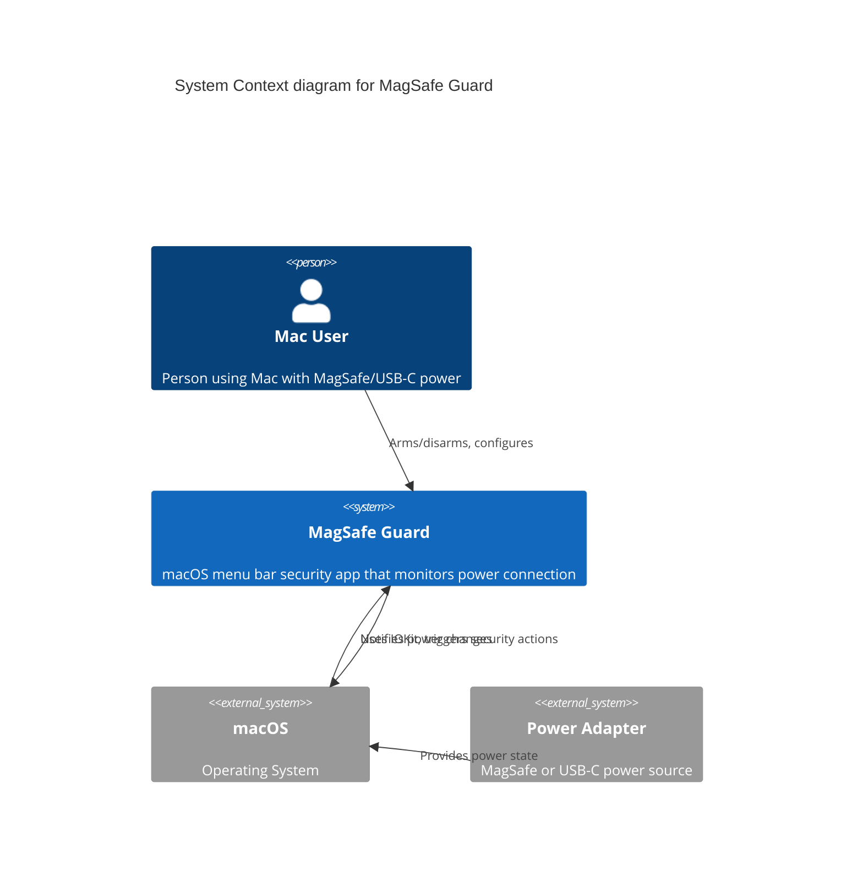
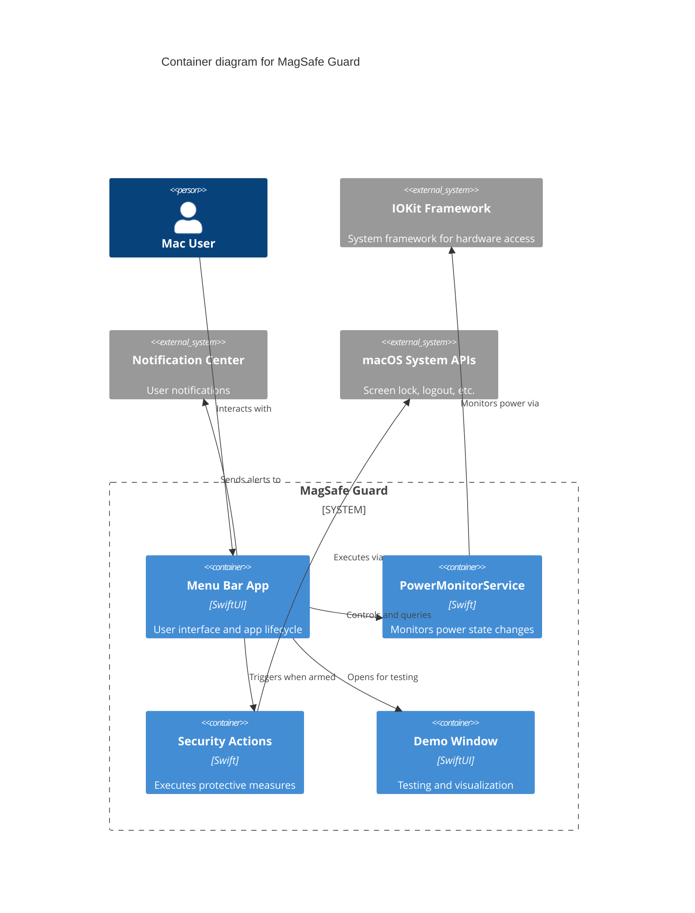
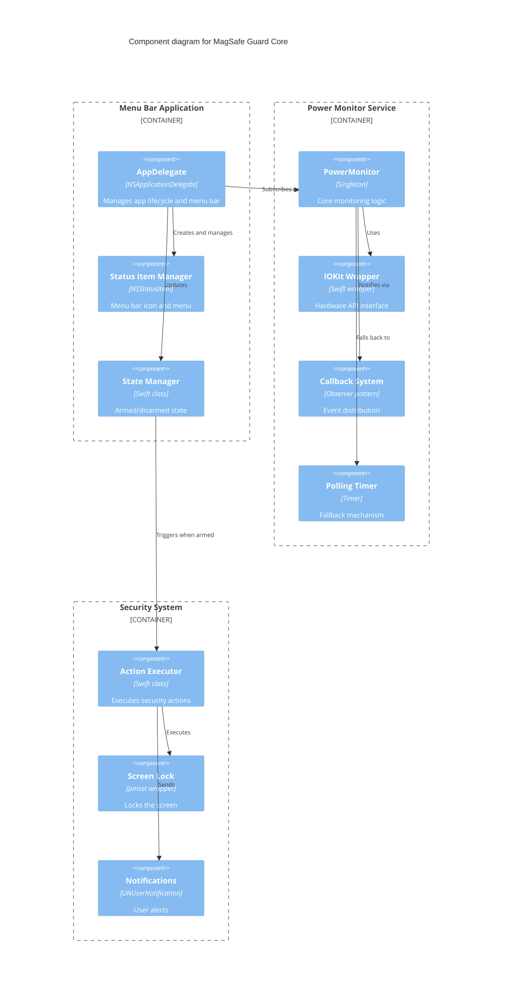

# MagSafe Guard Architecture Overview

## Overview

MagSafe Guard is a macOS security application that monitors power adapter connection status and triggers security actions when the power is disconnected while the system is armed. The app runs as a menu bar application with a focus on minimal resource usage and reliable detection.

## Architecture Diagram

### C4 Context Diagram

### C4 Container Diagram

### C4 Component Diagram

## Core Components

### 1. MagSafeGuardApp (Entry Point)

- **Location**: `Sources/MagSafeGuard/MagSafeGuardApp.swift`
- **Purpose**: SwiftUI app entry point and lifecycle management
- **Key Features**:
  - Sets up NSApplicationDelegateAdaptor
  - Configures app as menu bar only (no dock icon)

### 2. AppDelegate

- **Location**: `Sources/MagSafeGuard/MagSafeGuardApp.swift`
- **Purpose**: Main application controller
- **Responsibilities**:
  - Menu bar status item creation and management
  - Armed/disarmed state management
  - Menu construction and updates
  - Security action coordination
  - Demo window management

### 3. PowerMonitorService

- **Location**: `Sources/MagSafeGuard/Services/PowerMonitorService.swift`
- **Purpose**: Core power monitoring functionality
- **Key Features**:
  - Singleton pattern for global access
  - Thread-safe operation using DispatchQueue
  - IOKit integration for power state detection
  - Callback-based notification system
  - Both notification and polling modes supported

### 4. PowerMonitorDemoView

- **Location**: `Sources/MagSafeGuard/Views/PowerMonitorDemoView.swift`
- **Purpose**: Testing and demonstration UI
- **Features**:
  - Real-time power state visualization
  - Battery level display
  - Monitoring controls
  - SwiftUI-based interface

## Data Flow

### Power State Detection Flow

1. IOKit detects power source change
2. PowerMonitorService receives notification via callback
3. Service updates internal state and notifies observers
4. AppDelegate receives notification
5. If armed and power disconnected, security action triggered
6. Menu UI updated to reflect new state

### User Interaction Flow

1. User clicks menu bar icon
2. Menu displays current state and options
3. User selects action (Arm/Disarm, Show Demo, etc.)
4. AppDelegate handles action
5. State changes propagated through system
6. UI updates to reflect new state

## Key Design Patterns

### Singleton Pattern

- **Used in**: PowerMonitorService
- **Purpose**: Ensure single instance managing power monitoring
- **Benefits**: Global access, consistent state, resource efficiency

### Observer Pattern

- **Implementation**: Callback-based notifications
- **Purpose**: Decouple power monitoring from UI/actions
- **Benefits**: Flexible, testable, supports multiple observers

### Delegate Pattern

- **Used in**: NSApplicationDelegate
- **Purpose**: Handle app lifecycle events
- **Benefits**: Standard macOS pattern, clear separation of concerns

## Threading Model

### Main Thread

- UI updates
- Menu construction
- User interaction handling
- IOKit notification callbacks

### Background Queue

- Power state checking (when polling)
- State change processing
- Callback invocation coordination

### Thread Safety

- DispatchQueue serial queue for state management
- Main thread dispatch for UI updates
- Atomic state transitions

## Error Handling

### IOKit Failures

- Graceful fallback from notifications to polling
- Safe unwrapping of optional values
- Logging of error conditions

### Security Action Failures

- Process launch error handling
- Notification delivery fallback
- User feedback on failures

## Performance Characteristics

### CPU Usage

- Notification mode: < 0.1% idle
- Polling mode: ~0.1% with 100ms interval
- Event processing: < 5ms typical

### Memory Usage

- Base footprint: ~10MB
- Minimal allocations during operation
- No memory leaks with proper ARC usage

### Battery Impact

- Negligible in notification mode
- Minimal in polling mode
- No wake locks or persistent activities
