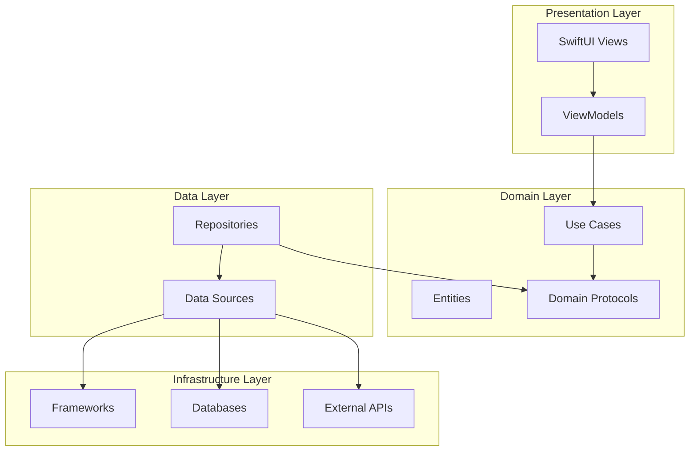

# Clean Architecture Patterns in MagSafe Guard

## Overview

This document describes how MagSafe Guard implements Clean Architecture principles, using the resource protection feature as a comprehensive example. The implementation demonstrates proper separation of concerns, dependency inversion, and protocol-oriented design.

> **Note**: For broader Swift best practices and SPM modularization strategy, see [Best Practices](best-practices.md). This document focuses specifically on Clean Architecture implementation details.

## Clean Architecture Layers



## Layer Responsibilities

### 1. Domain Layer (Business Logic)

**Location**: `MagSafeGuardLib/Sources/MagSafeGuardDomain/` (Swift Package)

**Responsibilities**:

- Business rules and logic
- Use case definitions
- Entity models
- Protocol definitions

**Example - ProtectedActionUseCase**:

```swift
// Pure business logic, no framework dependencies
public protocol ProtectedActionUseCaseProtocol {
    func execute(
        action: SecurityAction,
        completion: @escaping (Result<Void, SecurityActionError>) -> Void
    ) async
}

public final class ProtectedActionUseCase: ProtectedActionUseCaseProtocol {
    // Dependencies injected via protocols
    private let repository: SecurityActionRepository
    private let protectionPolicy: ResourceProtectionPolicy

    // Business logic implementation
    public func execute(...) async {
        // Orchestrate business rules
    }
}
```

**Key Principles**:

- No UI dependencies
- No framework dependencies
- Pure Swift code
- Testable in isolation

### 2. Data Layer (Data Management)

**Location**: `MagSafeGuard/Data/`

**Responsibilities**:

- Repository implementations
- Data source management
- Data transformation
- Caching strategies

**Example - MacSystemActionsRepository**:

```swift
public final class MacSystemActionsRepository: SecurityActionRepository {
    // Implements domain protocol
    // Manages data sources
    private let systemActions: SystemActionsProtocol
    private let resourceProtector: ResourceProtector

    public func lockScreen() async throws {
        // Data layer orchestration
        try await resourceProtector.executeProtected("lockScreen") {
            // Actual system call
        }
    }
}
```

**Key Principles**:

- Implements domain protocols
- Hides data source details
- Manages data consistency
- Handles data transformation

### 3. Infrastructure Layer (Technical Details)

**Location**: `MagSafeGuard/Security/`, `MagSafeGuard/Services/`

**Responsibilities**:

- Framework integration
- External service communication
- Technical implementations
- Platform-specific code

**Example - ResourceProtector**:

```swift
public actor ResourceProtector {
    // Technical implementation details
    private let rateLimiter: RateLimiter
    private let circuitBreaker: CircuitBreaker

    // Infrastructure concerns
    public func executeProtected<T>(
        _ action: String,
        operation: () async throws -> T
    ) async throws -> T {
        // Technical protection logic
    }
}
```

**Key Principles**:

- Contains technical complexity
- Platform-specific implementations
- External service integration
- Framework dependencies isolated here

### 4. Presentation Layer (UI)

**Location**: `MagSafeGuard/Presentation/`

**Responsibilities**:

- User interface
- User interaction handling
- Presentation logic
- View state management

**Example - SecurityViewModel**:

```swift
@MainActor
final class SecurityViewModel: ObservableObject {
    // UI state
    @Published var isLocked = false
    @Published var errorMessage: String?

    // Use case dependency
    private let protectedActionUseCase: ProtectedActionUseCaseProtocol

    func lockScreen() async {
        await protectedActionUseCase.execute(action: .lockScreen) { result in
            // Update UI state
        }
    }
}
```

## Dependency Flow

### Dependency Inversion Principle

High-level modules don't depend on low-level modules. Both depend on abstractions.

```swift
// ❌ Wrong: High-level depending on low-level
class UseCase {
    let database = SQLiteDatabase() // Direct dependency
}

// ✅ Correct: Both depend on abstraction
protocol DatabaseProtocol { }
class UseCase {
    let database: DatabaseProtocol // Protocol dependency
}
class SQLiteDatabase: DatabaseProtocol { }
```

### Dependency Injection Pattern

MagSafe Guard uses constructor injection:

```swift
// Domain defines the protocol
public protocol SecurityActionRepository {
    func lockScreen() async throws
}

// Use case depends on protocol
public final class ProtectedActionUseCase {
    private let repository: SecurityActionRepository

    public init(repository: SecurityActionRepository) {
        self.repository = repository
    }
}

// Data layer provides implementation
public final class MacSystemActionsRepository: SecurityActionRepository {
    // Implementation details
}

// Composition root wires dependencies
let repository = MacSystemActionsRepository()
let useCase = ProtectedActionUseCase(repository: repository)
```

## Protocol-Oriented Design

### Protocol Definitions

Protocols define boundaries between layers:

```swift
// Domain protocols (owned by domain layer)
public protocol ResourceProtectionPolicy {
    func validateAction(_ action: SecurityActionType) async throws
    func recordSuccess(_ action: SecurityActionType) async
    func recordFailure(_ action: SecurityActionType) async
}

// Infrastructure protocols (owned by infrastructure)
public protocol RateLimiterProtocol: Sendable {
    func allowAction(_ action: String) async -> Bool
    func reset(action: String) async
}
```

### Protocol Composition

Combine protocols for complex behaviors:

```swift
protocol Trackable {
    func track(event: String)
}

protocol Cacheable {
    func cache(key: String, value: Any)
}

// Compose protocols
protocol Repository: Trackable, Cacheable {
    func fetch() async throws
}
```

## Adapter Pattern Implementation

The adapter pattern bridges different layers:

```swift
// Infrastructure component
public actor ResourceProtector {
    // Infrastructure-specific implementation
}

// Adapter bridges to domain
public final class ResourceProtectionPolicyAdapter: ResourceProtectionPolicy {
    private let resourceProtector: ResourceProtector

    // Adapts infrastructure to domain protocol
    public func validateAction(_ action: SecurityActionType) async throws {
        let actionKey = mapActionTypeToKey(action)
        try await resourceProtector.checkAction(actionKey)
    }

    // Maps errors between layers
    private func mapProtectionError(_ error: ResourceProtectionError) -> SecurityActionError {
        // Error transformation logic
    }
}
```

## Testing Strategy

### Unit Testing by Layer

**Domain Layer Tests**:

```swift
class ProtectedActionUseCaseTests: XCTestCase {
    func testExecuteWithProtection() async {
        // Given - Mock dependencies
        let mockRepository = MockSecurityActionRepository()
        let mockPolicy = MockResourceProtectionPolicy()
        let sut = ProtectedActionUseCase(
            repository: mockRepository,
            protectionPolicy: mockPolicy
        )

        // When
        await sut.execute(action: .lockScreen) { _ in }

        // Then
        XCTAssertTrue(mockPolicy.validateCalled)
        XCTAssertTrue(mockRepository.lockScreenCalled)
    }
}
```

**Infrastructure Layer Tests**:

```swift
class RateLimiterTests: XCTestCase {
    func testTokenConsumption() async {
        // Test technical implementation
        let sut = RateLimiter(defaultCapacity: 3)

        // Verify token bucket algorithm
        let result1 = await sut.allowAction("test")
        XCTAssertTrue(result1)
    }
}
```

### Integration Testing

Test layer interactions:

```swift
class RepositoryIntegrationTests: XCTestCase {
    func testEndToEndProtection() async {
        // Real components, test configuration
        let repository = MacSystemActionsRepository(
            systemActions: MockSystemActions(),
            resourceProtectorConfig: .testConfig
        )

        // Test complete flow
        try await repository.lockScreen()
    }
}
```

## File Organization

### SPM/Xcode Separation Structure

As detailed in [Best Practices - SPM Separation](best-practices.md#swift-package-manager-drives-modularization-and-testability), the project separates business logic (SPM) from platform code (Xcode):

```ini
MagSafeGuardLib/                 # Swift Package (100% Testable)
├── Sources/
│   └── MagSafeGuardDomain/
│       ├── UseCases/
│       │   └── ProtectedActionUseCase.swift
│       ├── Entities/
│       │   └── SecurityAction.swift
│       └── Protocols/
│           └── ResourceProtectionPolicy.swift
└── Tests/
    └── MagSafeGuardDomainTests/

MagSafeGuard/                    # Xcode Project (Platform)
├── Data/
│   ├── Repositories/
│   │   └── MacSystemActionsRepository.swift
│   └── DataSources/
│       └── SystemActionsDataSource.swift
├── Security/                    # Infrastructure
│   ├── RateLimiter.swift
│   ├── CircuitBreaker.swift
│   └── ResourceProtector.swift
└── Presentation/
    ├── ViewModels/
    │   └── SecurityViewModel.swift
    └── Views/
        └── SecurityView.swift
```

## Benefits of Clean Architecture

### 1. Testability

- Each layer can be tested independently
- Mock implementations via protocols
- No UI testing needed for business logic

### 2. Maintainability

- Clear separation of concerns
- Changes isolated to specific layers
- Easy to understand and modify

### 3. Flexibility

- Swap implementations without affecting other layers
- Platform independence in domain layer
- Easy to add new features

### 4. Reusability

- Domain logic can be reused across platforms
- Infrastructure components are pluggable
- Shared protocols enable code sharing

## Common Patterns

### Repository Pattern

Abstracts data access:

```swift
protocol UserRepository {
    func getUser(id: String) async throws -> User
    func saveUser(_ user: User) async throws
}

class RemoteUserRepository: UserRepository {
    // API implementation
}

class LocalUserRepository: UserRepository {
    // Database implementation
}
```

### Use Case Pattern

Encapsulates business logic:

```swift
class GetUserProfileUseCase {
    private let userRepository: UserRepository
    private let imageRepository: ImageRepository

    func execute(userId: String) async throws -> UserProfile {
        // Orchestrate multiple repositories
        let user = try await userRepository.getUser(id: userId)
        let avatar = try await imageRepository.getImage(id: user.avatarId)
        return UserProfile(user: user, avatar: avatar)
    }
}
```

### Factory Pattern

Creates objects without specifying exact classes:

```swift
protocol RepositoryFactory {
    func makeUserRepository() -> UserRepository
    func makeImageRepository() -> ImageRepository
}

class ProductionRepositoryFactory: RepositoryFactory {
    func makeUserRepository() -> UserRepository {
        return RemoteUserRepository()
    }
}

class TestRepositoryFactory: RepositoryFactory {
    func makeUserRepository() -> UserRepository {
        return MockUserRepository()
    }
}
```

## Anti-Patterns to Avoid

### 1. Layer Violations

```swift
// ❌ Wrong: Domain depending on UI
class UseCase {
    import SwiftUI // Never import UI in domain
    @Published var state: State // UI concern in domain
}

// ✅ Correct: Domain is UI-agnostic
class UseCase {
    func execute() async -> Result
}
```

### 2. Anemic Domain Model

```swift
// ❌ Wrong: Logic outside entity
struct User {
    let email: String
}
class UserService {
    func isValidEmail(_ user: User) -> Bool // Logic separated
}

// ✅ Correct: Rich domain model
struct User {
    let email: String

    var isValidEmail: Bool {
        // Logic with data
    }
}
```

### 3. God Objects

```swift
// ❌ Wrong: Single class doing everything
class AppManager {
    func loginUser() { }
    func fetchData() { }
    func saveToDatabase() { }
    func updateUI() { }
}

// ✅ Correct: Separated responsibilities
class LoginUseCase { }
class DataRepository { }
class UIViewModel { }
```

## Migration Strategy

### Step 1: Identify Layers

1. List all current components
2. Categorize by responsibility
3. Identify layer violations

### Step 2: Define Protocols

1. Create domain protocols
2. Define repository interfaces
3. Establish layer boundaries

### Step 3: Refactor Incrementally

1. Start with one feature
2. Extract use cases
3. Create repositories
4. Add adapters as needed

### Step 4: Add Tests

1. Unit test each layer
2. Integration test boundaries
3. Maintain test coverage

## Conclusion

Clean Architecture in MagSafe Guard provides:

- Clear separation of concerns
- Testable business logic
- Flexible and maintainable code
- Platform-independent domain layer
- Scalable architecture for growth

The resource protection feature demonstrates these principles in action, showing how complex technical requirements can be implemented while maintaining architectural integrity.
