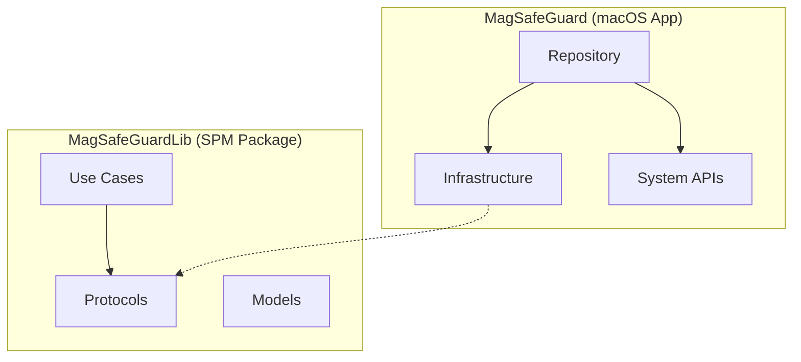

# Clean Architecture Refactoring Guide

## Overview

This document explains the refactoring of resource protection code to achieve proper Clean Architecture separation between `MagSafeGuardLib` (business logic) and `MagSafeGuard` (infrastructure).

## Architecture Separation

### MagSafeGuardLib (Swift Package - 100% Testable)

Located in `MagSafeGuardLib/Sources/MagSafeGuardDomain/`:

#### 1. **Protocols** (`Protocols/`)

Pure abstractions with no implementation details:

- **`ResourceProtectionProtocols.swift`**
  - `ResourceProtectionPolicy` - Domain abstraction for protection
  - `RateLimiterProtocol` - Rate limiting contract
  - `CircuitBreakerProtocol` - Circuit breaker contract
  - `CircuitState` enum - Domain state model
  - Configuration models (`RateLimiterConfig`, `CircuitBreakerConfig`, `ResourceProtectorConfig`)

#### 2. **Use Cases** (`UseCases/`)

Pure business logic:

- **`ProtectedActionUseCase.swift`**
  - `ProtectedActionUseCaseProtocol` - Use case abstraction
  - `ProtectedActionUseCase` - Business logic implementation
  - `ProtectedSecurityAction` enum - Domain action model
  - `ProtectedActionUseCaseFactory` - Factory pattern

#### 3. **Domain Models**

- `ProtectionMetrics` - Domain metrics model
- Configuration structs - Pure data structures

### MagSafeGuard (macOS App - Platform Dependencies)

Located in `MagSafeGuard/`:

#### 1. **Infrastructure** (`Security/`)

Concrete implementations with technical details:

- **`RateLimiter.swift`** - Actor-based rate limiting implementation
- **`CircuitBreaker.swift`** - Actor-based circuit breaker implementation
- **`ResourceProtector.swift`** - Concrete coordinator implementation
- **`ResourceProtectionPolicyAdapter.swift`** - Adapter bridging infrastructure to domain

#### 2. **Data Layer** (`Data/Repositories/`)

- **`MacSystemActionsRepository.swift`** - macOS system integration

#### 3. **Services** (`Services/`)

- **`MacSystemActions.swift`** - Platform-specific system calls
- **`SystemActionsProtocol.swift`** - Platform abstraction

## Benefits of This Separation

### 1. **100% Unit Testable Business Logic**

MagSafeGuardLib can be fully tested without any platform dependencies:

```swift
// Pure unit test - no macOS dependencies
func testProtectedActionWithRateLimit() async {
    // Given - Mock all dependencies
    let mockRepository = MockSecurityActionRepository()
    let mockPolicy = MockResourceProtectionPolicy()
    let useCase = ProtectedActionUseCase(
        repository: mockRepository,
        protectionPolicy: mockPolicy
    )
    
    // When - Test pure business logic
    mockPolicy.shouldFailValidation = true
    await useCase.execute(action: .lockScreen) { result in
        // Then - Verify behavior
        XCTAssertEqual(result, .failure(.rateLimitExceeded))
    }
}
```

### 2. **Clear Dependency Flow**



### 3. **Platform Independence**

Business logic in MagSafeGuardLib can be:

- Reused on different platforms (iOS, watchOS)
- Tested on Linux CI/CD pipelines
- Shared across multiple apps

### 4. **Dependency Injection**

Clean interfaces enable easy mocking:

```swift
// Production
let protectionPolicy = ResourceProtectionPolicyAdapter(
    resourceProtector: ResourceProtector()
)

// Testing
let protectionPolicy = MockResourceProtectionPolicy()

// Use case doesn't know the difference
let useCase = ProtectedActionUseCase(
    repository: repository,
    protectionPolicy: protectionPolicy
)
```

## Testing Strategy

### MagSafeGuardLib Tests (100% Coverage Target)

Located in `MagSafeGuardLib/Tests/`:

1. **Unit Tests**
   - `ProtectedActionUseCaseTests.swift` - Business logic tests
   - Use `MockResourceProtectionPolicy` for isolation
   - Test all business rules and edge cases

2. **Mock Infrastructure**
   - `MockResourceProtection.swift` - Test doubles
   - `MockRateLimiter` - Behavior verification
   - `MockCircuitBreaker` - State testing

### MagSafeGuard Tests (Integration)

Located in `MagSafeGuardTests/`:

1. **Infrastructure Tests**
   - `RateLimiterTests.swift` - Actor implementation
   - `CircuitBreakerTests.swift` - State machine
   - `ResourceProtectorTests.swift` - Coordination

2. **Integration Tests**
   - `MacSystemActionsRepositoryTests.swift` - End-to-end with mocks

## Migration Checklist

### Completed ✅

- [x] Created domain protocols in `MagSafeGuardLib/Sources/MagSafeGuardDomain/Protocols/`
- [x] Created use cases in `MagSafeGuardLib/Sources/MagSafeGuardDomain/UseCases/`
- [x] Created mock implementations in `MagSafeGuardLib/Tests/TestInfrastructure/Mocks/`
- [x] Created unit tests in `MagSafeGuardLib/Tests/MagSafeGuardDomainTests/`
- [x] Kept infrastructure in `MagSafeGuard/Security/`
- [x] Maintained repository in `MagSafeGuard/Data/Repositories/`

### To Do

- [ ] Update `MacSystemActionsRepository` to use protocols from MagSafeGuardLib
- [ ] Update infrastructure components to implement MagSafeGuardLib protocols
- [ ] Add integration tests using both layers
- [ ] Update Package.swift dependencies
- [ ] Add CI/CD tests for MagSafeGuardLib

## Usage Examples

### In MagSafeGuardLib (Pure Business Logic)

```swift
// Use case with injected dependencies
let useCase = ProtectedActionUseCase(
    repository: repository,        // Protocol from MagSafeGuardDomain
    protectionPolicy: policy        // Protocol from MagSafeGuardDomain
)

// Execute protected action
await useCase.execute(action: .lockScreen) { result in
    // Handle result
}
```

### In MagSafeGuard (With Infrastructure)

```swift
// Create infrastructure
let resourceProtector = ResourceProtector(
    rateLimiterConfig: .default,
    circuitBreakerConfig: .default
)

// Adapt to domain protocol
let protectionPolicy = ResourceProtectionPolicyAdapter(
    resourceProtector: resourceProtector
)

// Create repository with protection
let repository = MacSystemActionsRepository(
    systemActions: MacSystemActions(),
    resourceProtectorConfig: .default
)

// Wire everything together
let useCase = ProtectedActionUseCase(
    repository: repository,
    protectionPolicy: protectionPolicy
)
```

## Best Practices

### 1. **Keep Domain Pure**

- No framework imports in MagSafeGuardLib
- No platform-specific code
- Only Foundation and Swift standard library

### 2. **Use Protocols for Boundaries**

- Define contracts in MagSafeGuardLib
- Implement in MagSafeGuard
- Test with mocks

### 3. **Leverage Type Safety**

- Use enums for actions
- Use structs for configuration
- Use protocols for abstraction

### 4. **Test at the Right Level**

- Unit test business logic in MagSafeGuardLib
- Integration test in MagSafeGuard
- Mock at protocol boundaries

## Conclusion

This refactoring achieves:

1. **100% testable business logic** in MagSafeGuardLib
2. **Clear separation** between business rules and infrastructure
3. **Platform independence** for core logic
4. **Clean Architecture** principles throughout
5. **Improved maintainability** and scalability

The resource protection feature now follows industry best practices for Clean Architecture in Swift, with proper separation between the Swift Package (MagSafeGuardLib) containing pure business logic and the macOS app (MagSafeGuard) containing platform-specific implementations.
