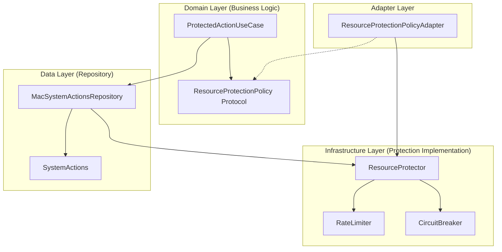

# Resource Protection Architecture Guide

## Overview

MagSafe Guard implements comprehensive resource protection using **rate limiting** and **circuit breaker** patterns to ensure system stability and prevent abuse. This implementation follows Clean Architecture principles to maintain clear separation between business logic and infrastructure concerns.

## Architecture Components

### Core Protection Mechanisms



## Component Descriptions

### 1. Rate Limiter (`RateLimiter.swift`)

Implements a **token bucket algorithm** for controlling the rate of operations:

- **Purpose**: Prevents excessive use of system resources
- **Algorithm**: Token bucket with configurable capacity and refill rate
- **Thread-Safe**: Implemented as an actor for concurrent access

```swift
// Configuration example
let config = RateLimiterConfig(
    lockScreen: (capacity: 5, refillRate: 2.0),     // 5 locks per 10 seconds
    playAlarm: (capacity: 3, refillRate: 5.0),      // 3 alarms per 15 seconds
    forceLogout: (capacity: 2, refillRate: 30.0),   // 2 logouts per minute
    shutdown: (capacity: 1, refillRate: 60.0),      // 1 shutdown per minute
    executeScript: (capacity: 3, refillRate: 10.0)  // 3 scripts per 30 seconds
)
```

### 2. Circuit Breaker (`CircuitBreaker.swift`)

Provides fault tolerance through state-based protection:

- **States**:

  - `closed`: Normal operation
  - `open`: Service unavailable (failing fast)
  - `halfOpen`: Testing recovery

- **Transitions**:

  ```text
  CLOSED --(failures >= threshold)--> OPEN
  OPEN --(timeout elapsed)--> HALF_OPEN
  HALF_OPEN --(success >= threshold)--> CLOSED
  HALF_OPEN --(any failure)--> OPEN
  ```

### 3. Resource Protector (`ResourceProtector.swift`)

Coordinates both protection mechanisms:

- Combines rate limiting and circuit breaking
- Tracks metrics for monitoring
- Provides unified interface for protection

```swift
// Usage
try await resourceProtector.executeProtected("lockScreen") {
    // Protected operation
    try await systemActions.lockScreen()
}
```

### 4. Clean Architecture Integration

#### Use Case Layer (`ProtectedActionUseCase.swift`)

Pure business logic that orchestrates security actions:

```swift
public protocol ProtectedActionUseCaseProtocol {
    func execute(
        action: SecurityAction,
        completion: @escaping (Result<Void, SecurityActionError>) -> Void
    ) async
}
```

#### Adapter Pattern (`ResourceProtectionPolicyAdapter.swift`)

Bridges infrastructure with domain layer:

```swift
public final class ResourceProtectionPolicyAdapter: ResourceProtectionPolicy {
    // Adapts ResourceProtector to domain protocol
    // Maps infrastructure errors to domain errors
}
```

## Configuration Profiles

### Default Configuration

Balanced protection for normal operation:

```swift
ResourceProtectorConfig.defaultConfig = ResourceProtectorConfig(
    rateLimiter: .defaultConfig,
    circuitBreaker: .defaultConfig,
    enableMetrics: true,
    enableLogging: true
)
```

### Strict Configuration

Enhanced protection for high-security environments:

```swift
ResourceProtectorConfig.strict = ResourceProtectorConfig(
    rateLimiter: .strict,      // Lower rate limits
    circuitBreaker: .resilient, // Higher failure tolerance
    enableMetrics: true,
    enableLogging: true
)
```

## Security Features

### Script Execution Protection

Enhanced validation for custom scripts:

1. **Path Validation**:

   - Must be absolute paths
   - File must exist
   - Allowed extensions: `.sh`, `.bash`, `.zsh`, `.command`

2. **Security Checks**:
   - No path traversal (`../`)
   - No shell expansion (`${}`, `$()`, backticks)
   - No home directory references (`~`)

```swift
private func validateScriptPath(_ path: String) -> Bool {
    // Security validation implementation
    let dangerousPatterns = ["../", "~", "${", "$(", "`"]
    // Check for dangerous patterns
}
```

### Rate Limiting Details

Token bucket implementation ensures:

- **Burst Protection**: Limited capacity prevents sudden spikes
- **Sustained Rate Control**: Refill rate controls long-term usage
- **Fair Resource Distribution**: Per-action buckets ensure balance

Example calculation:

- Capacity: 5 tokens
- Refill rate: 2 seconds/token
- Maximum burst: 5 actions instantly
- Sustained rate: 1 action every 2 seconds

### Circuit Breaker Details

Failure handling strategy:

1. **Failure Detection**: Count consecutive failures
2. **Fast Fail**: Open circuit prevents cascading failures
3. **Automatic Recovery**: Timed transition to half-open
4. **Gradual Resume**: Success threshold before full recovery

## Metrics and Monitoring

### Available Metrics

```swift
public struct ProtectionMetrics {
    let totalAttempts: Int
    let successfulExecutions: Int
    let rateLimitedAttempts: Int
    let circuitBreakerRejections: Int
    let lastAttemptTime: Date?
    let successRate: Double
}
```

### Accessing Metrics

```swift
// Get metrics for specific action
let metrics = await repository.getMetrics(for: .lockScreen)

// Metrics include:
// - totalAttempts: Total action attempts
// - successfulExecutions: Successful completions
// - rateLimitedAttempts: Rate limit rejections
// - circuitBreakerRejections: Circuit breaker blocks
// - successRate: Success percentage
```

## Error Handling

### Error Types

```swift
public enum ResourceProtectionError: LocalizedError {
    case rateLimited(action: String, retryAfter: TimeInterval)
    case circuitOpen(action: String, state: CircuitState)
    case resourceExhausted(action: String)
    case protectionDisabled
}
```

### Error Mapping

Errors are mapped through layers:

1. **Infrastructure Layer**: `ResourceProtectionError`
2. **Adapter Layer**: Maps to domain errors
3. **Domain Layer**: `SecurityActionError`
4. **Presentation Layer**: User-friendly messages

## Testing Strategy

### Unit Tests

Each component has comprehensive tests:

1. **RateLimiterTests**: Token consumption, refill, concurrency
2. **CircuitBreakerTests**: State transitions, timeout behavior
3. **ResourceProtectorTests**: Combined protection, metrics
4. **MacSystemActionsRepositoryTests**: Integration testing

### Test Configuration

Test-friendly configurations with short timeouts:

```swift
let testConfig = RateLimiterConfig(
    lockScreen: (capacity: 2, refillRate: 0.1), // Fast for testing
    // ...
)
```

## Usage Examples

### Basic Usage

```swift
// Initialize repository with protection
let repository = MacSystemActionsRepository(
    systemActions: MacSystemActions(),
    resourceProtectorConfig: .defaultConfig
)

// Actions are automatically protected
try await repository.lockScreen()
```

### Advanced Usage with Use Case

```swift
// Clean Architecture approach
let protectionPolicy = ResourceProtectionPolicyAdapter(config: .strict)
let useCase = ProtectedActionUseCase(
    repository: repository,
    protectionPolicy: protectionPolicy
)

// Execute with protection
await useCase.execute(action: .lockScreen) { result in
    switch result {
    case .success:
        print("Action completed")
    case .failure(let error):
        print("Action failed: \(error)")
    }
}
```

### Monitoring and Maintenance

```swift
// Check metrics
let metrics = await repository.getMetrics(for: .lockScreen)
if metrics["successRate"] as? Double ?? 0 < 0.5 {
    // Alert: High failure rate
}

// Reset protection if needed
await repository.resetProtection(for: .lockScreen)
```

## Best Practices

### 1. Configuration Selection

- Use `.defaultConfig` for normal operation
- Use `.strict` for high-security environments
- Create custom configurations for specific needs

### 2. Error Handling

- Always handle `ResourceProtectionError`
- Provide user feedback with retry information
- Log protection events for monitoring

### 3. Monitoring

- Regular metric review
- Alert on high failure rates
- Track rate limiting patterns

### 4. Testing

- Test with realistic configurations
- Verify protection under load
- Test recovery scenarios

## Migration Guide

### Integrating with Existing Code

#### Replace Direct Repository Calls

```swift
// Before
try await systemActions.lockScreen()

// After
try await repository.lockScreen() // Protected automatically
```

#### Add Metric Monitoring

```swift
// Add periodic metric checks
Timer.scheduledTimer(withTimeInterval: 60, repeats: true) { _ in
    Task {
        let metrics = await repository.getMetrics(for: .lockScreen)
        // Log or alert based on metrics
    }
}
```

#### Handle New Error Types

```swift
do {
    try await repository.lockScreen()
} catch {
    if case SecurityActionError.actionFailed(_, let reason) = error,
       reason.contains("Rate limited") {
        // Show retry UI
    }
}
```

## Performance Considerations

### Resource Usage

- **Memory**: Minimal overhead (~1KB per tracked action)
- **CPU**: O(1) for protection checks
- **Concurrency**: Actor-based thread safety

### Optimization Tips

1. **Batch Operations**: Group related actions when possible
2. **Async/Await**: Leverage Swift concurrency for efficiency
3. **Metric Collection**: Sample metrics rather than continuous monitoring

## Security Considerations

### Threat Mitigation

1. **DoS Prevention**: Rate limiting prevents resource exhaustion
2. **Cascading Failures**: Circuit breaker prevents system-wide failures
3. **Script Injection**: Path validation prevents malicious script execution

### Compliance

- Implements defense-in-depth strategy
- Provides audit trail through metrics
- Configurable for different security policies

## Future Enhancements

### Planned Features

1. **Dynamic Configuration**: Runtime adjustment of limits
2. **Persistent Metrics**: Store metrics across sessions
3. **Advanced Patterns**: Sliding window, adaptive limits
4. **Dashboard Integration**: Real-time monitoring UI

### Extension Points

The architecture supports easy extension:

- Custom protection policies
- Additional metrics
- New protection patterns
- Integration with monitoring systems

## Conclusion

The resource protection system provides robust, scalable protection for system actions while maintaining clean architecture principles. It ensures system stability, prevents abuse, and provides comprehensive monitoring capabilities.
