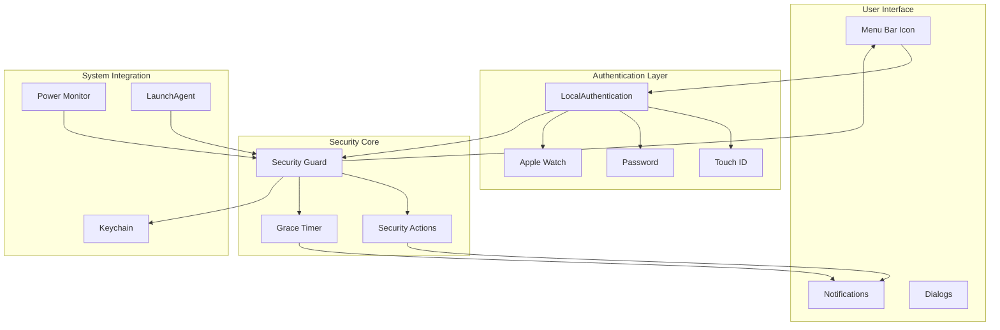
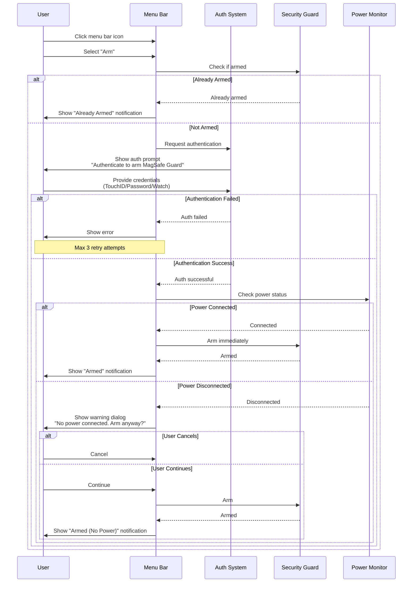
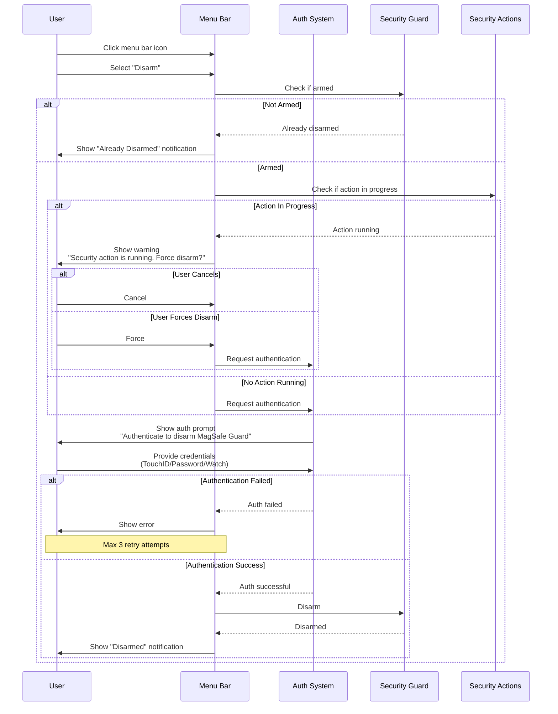
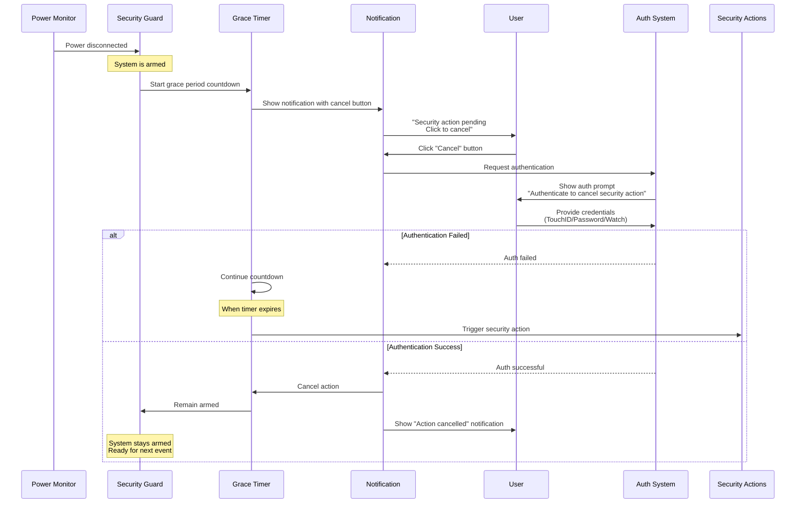

# Authentication Flow Design

## Overview

MagSafe Guard requires biometric or password authentication for all arm/disarm operations to prevent unauthorized state changes. This ensures that only the authorized user can modify the security state of their device.

## Authentication Methods

1. **Primary**: Touch ID (if available)
2. **Fallback**: System password
3. **Watch**: Apple Watch unlock (if configured)

## System Architecture



## User Flows

### 1. Arming Flow



### 2. Disarming Flow



### 3. Grace Period Recovery Flow



## Implementation

### Swift Code Structure

```swift
import LocalAuthentication
import UserNotifications

class AuthenticationManager {
    private let context = LAContext()
    private let reason = "Authenticate to modify security state"

    enum AuthPurpose {
        case arm
        case disarm
        case cancelAction

        var reason: String {
            switch self {
            case .arm:
                return "Authenticate to arm MagSafe Guard"
            case .disarm:
                return "Authenticate to disarm MagSafe Guard"
            case .cancelAction:
                return "Authenticate to cancel security action"
            }
        }
    }

    func authenticate(for purpose: AuthPurpose,
                     completion: @escaping (Bool, Error?) -> Void) {
        // Check biometric availability
        var error: NSError?
        let canUseBiometrics = context.canEvaluatePolicy(
            .deviceOwnerAuthenticationWithBiometrics,
            error: &error
        )

        // Set authentication policy
        let policy: LAPolicy = canUseBiometrics
            ? .deviceOwnerAuthenticationWithBiometrics
            : .deviceOwnerAuthentication

        // Configure context
        context.localizedReason = purpose.reason
        context.localizedCancelTitle = "Cancel"
        context.localizedFallbackTitle = "Use Password"

        // Perform authentication
        context.evaluatePolicy(policy,
                              localizedReason: purpose.reason) { success, error in
            DispatchQueue.main.async {
                completion(success, error)
            }
        }
    }

    func invalidateContext() {
        context.invalidate()
    }
}
```

### Menu Bar Integration

```swift
class MenuBarController {
    private let authManager = AuthenticationManager()

    @objc func toggleArmedState() {
        if securityManager.isArmed {
            requestDisarm()
        } else {
            requestArm()
        }
    }

    private func requestArm() {
        authManager.authenticate(for: .arm) { [weak self] success, error in
            guard success else {
                self?.showAuthError(error)
                return
            }

            // Check power status before arming
            if !self?.powerMonitor.isConnected ?? false {
                self?.showNoPowerWarning {
                    self?.securityManager.arm()
                }
            } else {
                self?.securityManager.arm()
            }
        }
    }

    private func requestDisarm() {
        // Check if action is in progress
        if securityManager.isActionInProgress {
            showActionInProgressWarning { [weak self] in
                self?.authenticateAndDisarm()
            }
        } else {
            authenticateAndDisarm()
        }
    }

    private func authenticateAndDisarm() {
        authManager.authenticate(for: .disarm) { [weak self] success, error in
            guard success else {
                self?.showAuthError(error)
                return
            }

            self?.securityManager.disarm()
        }
    }
}
```

## Security Considerations

### 1. Authentication Bypass Prevention

- No keyboard shortcuts for arm/disarm
- No AppleScript support for state changes
- No URL scheme handlers for state changes
- Required authentication cannot be disabled via config

### 2. Timeout Handling

- Auth prompt timeout: 30 seconds (configurable)
- After timeout, operation is cancelled
- User must reinitiate the operation

### 3. Failed Attempts

- Max 3 failed attempts per operation
- After 3 failures, 1-minute cooldown
- Prevents brute force attempts

### 4. Session Management

- Authentication is per-operation (no session)
- Each state change requires fresh authentication
- Prevents replay attacks

## Notification Integration

### Armed State Notifications

```swift
func showArmedNotification(powerConnected: Bool) {
    let content = UNMutableNotificationContent()
    content.title = "MagSafe Guard Armed"
    content.body = powerConnected
        ? "Protection active. Power adapter connected."
        : "Protection active. ⚠️ No power connected."
    content.sound = .default
    content.categoryIdentifier = "ARMED_STATE"

    let request = UNNotificationRequest(
        identifier: "armed",
        content: content,
        trigger: nil
    )

    UNUserNotificationCenter.current().add(request)
}
```

### Grace Period Notifications

```swift
func showGracePeriodNotification(remainingSeconds: Int) {
    let content = UNMutableNotificationContent()
    content.title = "⚠️ Security Action Pending"
    content.body = "Power disconnected! Action in \(remainingSeconds) seconds."
    content.sound = .defaultCritical
    content.categoryIdentifier = "GRACE_PERIOD"
    content.interruptionLevel = .critical

    // Add cancel action
    let cancelAction = UNNotificationAction(
        identifier: "CANCEL_ACTION",
        title: "Cancel",
        options: [.authenticationRequired, .destructive]
    )

    let category = UNNotificationCategory(
        identifier: "GRACE_PERIOD",
        actions: [cancelAction],
        intentIdentifiers: []
    )

    UNUserNotificationCenter.current().setNotificationCategories([category])
}
```

## Error Handling

### Common Errors

1. **Biometry not available**: Fall back to password
2. **Biometry not enrolled**: Fall back to password
3. **User cancelled**: Show "Operation cancelled"
4. **Authentication failed**: Show "Authentication failed"
5. **Too many attempts**: Show cooldown message

### Error Messages

```swift
func getErrorMessage(for error: Error?) -> String {
    guard let laError = error as? LAError else {
        return "Authentication failed"
    }

    switch laError.code {
    case .userCancel:
        return "Authentication cancelled"
    case .authenticationFailed:
        return "Authentication failed. Please try again."
    case .biometryLockout:
        return "Too many failed attempts. Please use your password."
    case .biometryNotAvailable:
        return "Touch ID not available. Please use your password."
    case .biometryNotEnrolled:
        return "Touch ID not configured. Please use your password."
    default:
        return "Authentication error. Please try again."
    }
}
```

## Testing Considerations

### Unit Tests

- Mock LAContext for testing auth flows
- Test all error scenarios
- Verify retry limits
- Test timeout behavior

### UI Tests

- Test TouchID prompt appearance
- Test password fallback
- Test notification interactions
- Test grace period cancellation

### Manual Testing Checklist

- TouchID successful authentication
- TouchID with wrong finger (3x)
- Password fallback
- Cancel authentication
- Timeout behavior (30s)
- Grace period cancel with auth
- Multiple rapid auth requests
- Auth while action in progress
