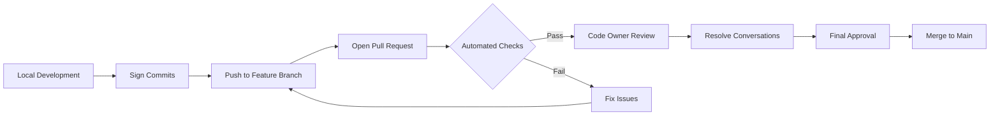

# Branch Protection Ruleset Documentation

This document describes the active branch protection ruleset for the MagSafe Guard repository.

## Ruleset Overview

- **Name**: Protected
- **Target**: Branch (specifically the default branch - `main`)
- **Enforcement**: Active
- **Repository**: lekman/magsafe-buskill

## Protected Branches

The ruleset applies to:

- `~DEFAULT_BRANCH` (main branch)

## Protection Rules

### 1. Deletion Protection 🗑️

- **Type**: `deletion`
- **Effect**: Prevents the branch from being deleted
- **Purpose**: Protects against accidental or malicious branch deletion

### 2. Force Push Protection 🚫

- **Type**: `non_fast_forward`
- **Effect**: Blocks force pushes and history rewrites
- **Purpose**: Preserves commit history integrity

### 3. Commit Signature Requirements ✍️

- **Type**: `required_signatures`
- **Effect**: All commits must be signed (GPG or S/MIME)
- **Purpose**: Ensures commit authenticity and non-repudiation

### 4. Pull Request Requirements 🔄

All changes must go through a pull request with these requirements:

| Setting                             | Value        | Description                                   |
| ----------------------------------- | ------------ | --------------------------------------------- |
| **Required Approvals**              | 0            | No approval required (relies on other checks) |
| **Dismiss Stale Reviews**           | ❌ False     | Reviews remain valid after new pushes         |
| **Require Code Owner Review**       | ✅ True      | CODEOWNERS must review changes to their files |
| **Require Last Push Approval**      | ✅ True      | The most recent push must be approved         |
| **Require Conversation Resolution** | ✅ True      | All PR comments must be resolved              |
| **Copilot Code Review**             | ✅ Enabled   | Automatic AI-powered code review              |
| **Allowed Merge Methods**           | `merge` only | Only merge commits allowed (no squash/rebase) |

### 5. Code Scanning Requirements 🔍

CodeQL scanning must pass with these thresholds:

| Tool       | Security Alerts Threshold | Code Quality Threshold |
| ---------- | ------------------------- | ---------------------- |
| **CodeQL** | `high_or_higher`          | `errors`               |

This means:

- **Security**: Only high and critical security alerts block merge
- **Quality**: Only error-level code quality issues block merge

## Bypass Permissions

- **Repository Role ID 5**: Can bypass all rules with `always` mode
- This typically corresponds to repository administrators

## How to Configure This Ruleset

### Via GitHub UI

1. Go to **Settings** → **Rules** → **Rulesets**
2. Click **New ruleset** → **New branch ruleset**
3. Configure as follows:

#### Basic Settings

- **Ruleset Name**: Protected
- **Enforcement status**: Active
- **Target branches**: Include default branch

#### Rules to Enable

1. ✅ **Restrict deletions**
2. ✅ **Restrict force pushes**
3. ✅ **Require signed commits**
4. ✅ **Require a pull request before merging**:
   - Required approvals: 0
   - Dismiss stale reviews: No
   - Require review from CODEOWNERS: Yes
   - Require approval of most recent push: Yes
   - Require conversation resolution: Yes
   - Automatic Copilot review: Yes
   - Allowed merge methods: Merge commit only
5. ✅ **Require status checks**:
   - Add CodeQL with specified thresholds

#### Bypass List

- Add: Repository Administrator role

### Via GitHub API

```bash
# Export current ruleset
gh api /repos/lekman/magsafe-buskill/rulesets/6934891 > ruleset.json

# Import to another repo (modify source field first)
gh api /repos/OWNER/REPO/rulesets \
  --method POST \
  --input ruleset.json
```

## Integration with CI/CD

This ruleset works in conjunction with our GitHub Actions workflows:

1. **Commit Message Check** (`commit-message-check.yml`)

   - Validates conventional commits format
   - Blocks prohibited words

2. **Enforce Clean History** (`enforce-clean-history.yml`)

   - Prevents commits with blocked words
   - Provides detailed fix instructions

3. **Security Workflow** (`security.yml`)
   - Runs comprehensive security scans
   - Must pass before merge

## Developer Workflow

With this ruleset active:



## Common Scenarios

### Scenario 1: Unsigned Commit

```bash
# Error: Commits must be signed
# Fix: Configure commit signing
git config --global user.signingkey YOUR_KEY_ID
git config --global commit.gpgsign true
```

### Scenario 2: Direct Push Attempt

```bash
# Error: Updates must go through pull request
# Fix: Create a feature branch
git checkout -b feature/my-change
git push -u origin feature/my-change
# Then open a PR
```

### Scenario 3: Unresolved Conversations

```text
# Error: All conversations must be resolved
# Fix: Address all PR comments and mark as resolved
```

### Scenario 4: CodeQL Security Alert

```text
# Error: High/Critical security issue detected
# Fix: Address the security vulnerability before merge
```

## Benefits of This Configuration

1. **No Force Push**: History remains intact and auditable
2. **No Deletion**: Main branch cannot be accidentally removed
3. **Signed Commits**: Ensures authenticity of all changes
4. **Code Review**: CODEOWNERS must approve their domain changes
5. **AI Review**: Copilot provides additional code quality checks
6. **Clean Merges**: Only merge commits keep clear history
7. **Security First**: CodeQL prevents high-risk vulnerabilities

## Monitoring and Compliance

### Audit Log

View ruleset activity in the audit log:

1. Go to **Settings** → **Audit log**
2. Filter by `ruleset` events

### Violations

When rules are violated, GitHub:

- Blocks the action
- Logs the attempt
- Shows clear error messages

### Bypass Usage

Administrator bypasses are logged and should be:

- Used sparingly
- Documented in PR descriptions
- Reviewed in security audits

## Best Practices

1. **Keep Commits Signed**: Set up GPG signing for all developers
2. **Use Feature Branches**: Never work directly on main
3. **Resolve Before Merge**: Address all PR feedback
4. **Monitor CodeQL**: Review security alerts regularly
5. **Document Bypasses**: If admin bypass is used, document why

## Troubleshooting

### "Commits are not signed"

```bash
# Check signing configuration
git config --get user.signingkey
git config --get commit.gpgsign

# Sign previous commit
git commit --amend --no-edit -S
```

### "Push declined due to ruleset violation"

- Check which rule was violated in the error message
- Ensure you're using a pull request
- Verify all requirements are met

### "CodeQL check failing"

- Review the Security tab for details
- Fix high/critical security issues
- Re-run the workflow after fixes

## Related Documentation

- [GitHub Rulesets Documentation](https://docs.github.com/en/repositories/configuring-branches-and-merges-in-your-repository/managing-rulesets)
- [Commit Signature Verification](https://docs.github.com/en/authentication/managing-commit-signature-verification)
- [CODEOWNERS Guide](https://docs.github.com/en/repositories/managing-your-repositorys-settings-and-features/customizing-your-repository/about-code-owners)
- [CodeQL Documentation](https://codeql.github.com/docs/)
