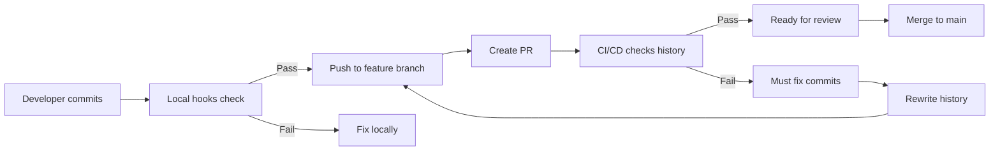

# Branch Protection Setup for Clean History

This guide ensures that no commits with prohibited words can ever enter protected branches.

## GitHub Settings Configuration

### 1. Navigate to Branch Protection

1. Go to your repository on GitHub
2. Click **Settings** → **Branches**
3. Click **Add rule** or edit existing rule for `main`

### 2. Configure Protection Rules

Enable these settings:

#### Basic Protection

- ✅ **Require a pull request before merging**
  - ✅ Require approvals: 1
  - ✅ Dismiss stale pull request approvals when new commits are pushed
  - ✅ Require review from CODEOWNERS

#### Status Checks

- ✅ **Require status checks to pass before merging**
  - ✅ Require branches to be up to date before merging
  - **Required status checks:**
    - `Enforce Clean Commit History`
    - `Validate Commit Messages`
    - `Security Scan / basic-checks`

#### Force Push Protection

- ✅ **Do not allow force pushes**
- ✅ **Do not allow deletions**

#### Administrator Enforcement

- ✅ **Include administrators** (IMPORTANT: This ensures even admins can't bypass)

### 3. Repeat for Other Protected Branches

Apply similar rules to:

- `develop`
- `release/*`
- Any other branches you want to protect

## How This Prevents Bad Commits

### Layer 1: No Direct Pushes

The workflow blocks any direct push to protected branches, forcing all changes through PRs.

### Layer 2: PR Validation

Every PR is scanned for prohibited words in the entire commit history.

### Layer 3: Merge Protection

GitHub physically prevents merging if the status checks fail.

### Layer 4: Admin Protection

Even repository administrators cannot bypass these checks when "Include administrators" is enabled.

## What Happens When Someone Tries

### Scenario 1: Direct Push Attempt

```bash
$ git push origin main
❌ remote: error: GH006: Protected branch update failed
```

### Scenario 2: PR with Bad Commits

1. PR is created
2. CI runs and detects prohibited words
3. Status check fails
4. PR cannot be merged
5. Automated comment explains how to fix

### Scenario 3: Admin Override Attempt

With "Include administrators" enabled, even admins see:

```text
Merging is blocked
The base branch requires all commits to pass status checks.
```

## Fixing Violations

When commits are rejected:

### Option 1: Rewrite History (Recommended)

```bash
# Interactive rebase
git rebase -i origin/main

# Change 'pick' to 'drop' for bad commits
# Or change to 'reword' to edit the message

# Force push the clean history
git push --force-with-lease
```

### Option 2: Create Clean Branch

```bash
# Start fresh
git checkout main
git pull origin main
git checkout -b feature/clean-impl

# Cherry-pick only good commits
git cherry-pick abc123 def456

# Or recreate the changes with new commits
# Then push the clean branch
git push -u origin feature/clean-impl
```

## Monitoring and Alerts

### Email Notifications

GitHub sends emails when:

- PRs fail status checks
- Direct pushes are blocked
- Branch protection is modified

### Audit Log

Repository admins can view the audit log to see:

- Who attempted direct pushes
- Who modified branch protection
- Failed merge attempts

## Emergency Procedures

If you absolutely must bypass (not recommended):

1. **Temporarily disable protection**

   - Remove "Include administrators"
   - Merge the PR
   - Re-enable immediately

2. **Better: Fix the commits**
   - It's always better to fix the history
   - Maintains repository integrity
   - Prevents future issues

## Best Practices

1. **Communicate the rules** - Ensure all contributors know about the restrictions
2. **Provide tools** - Share scripts to help fix commit messages
3. **Monitor regularly** - Check audit logs for bypass attempts
4. **Never disable permanently** - If you're disabling often, reconsider the rules

## Integration with Development Workflow



## Summary

With this setup:

- ❌ Bad commits cannot enter protected branches
- ✅ All changes must go through PR review
- ✅ Automated enforcement prevents human error
- ✅ Clear feedback helps developers fix issues
- ✅ Audit trail maintains accountability

This creates an unbypassable system that ensures your repository history remains clean and professional.
