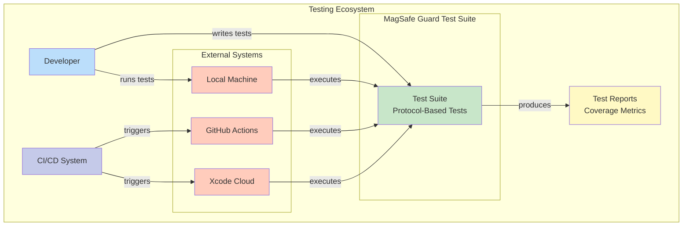
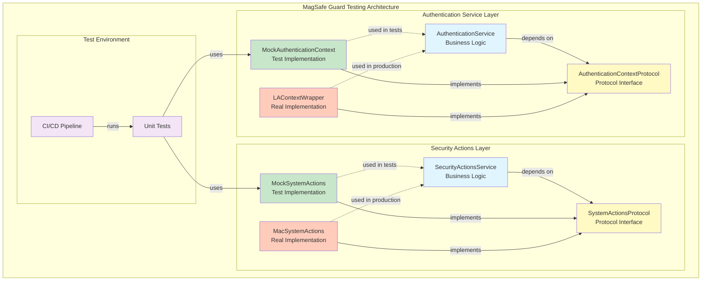
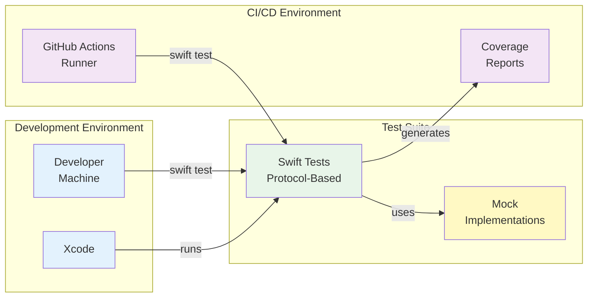

# Testing in CI/CD Environments

## Protocol-Based Testing Strategy

MagSafe Guard uses a protocol-based testing approach that ensures tests run identically in all environments - local development, simulators, and CI/CD pipelines.

### Key Principles

1. **No Real System Calls**: All system interactions are abstracted behind protocols
2. **Mock Everything External**: Tests use mock implementations exclusively
3. **Deterministic Behavior**: Tests produce the same results everywhere
4. **No Environment Variables**: CI=true is no longer needed

### Authentication Service Tests

The `AuthenticationService` uses protocol abstractions instead of real `LAContext`:

```swift
// Protocol for authentication context
protocol AuthenticationContextProtocol {
    func canEvaluatePolicy(_ policy: LAPolicy, error: NSErrorPointer) -> Bool
    func evaluatePolicy(_ policy: LAPolicy, localizedReason: String) async throws
    var biometryType: LABiometryType { get }
}

// Mock implementation for tests
class MockAuthenticationContext: AuthenticationContextProtocol {
    var canEvaluatePolicyResult = true
    var evaluatePolicyShouldSucceed = true
    // ... mock behavior configuration
}
```

## Test Behavior Consistency

### Same Behavior Everywhere

With protocol-based testing, tests behave identically in:

- Local development (any Mac)
- Xcode simulators
- GitHub Actions CI runners
- Any other CI/CD platform

### Test Examples

1. **Biometric Availability Tests**

   ```swift
   mockContext.canEvaluatePolicyResult = true
   mockContext.biometryType = .touchID
   XCTAssertTrue(service.isBiometricAuthenticationAvailable)
   ```

2. **Authentication Flow Tests**

   ```swift
   mockContext.evaluatePolicyShouldSucceed = true
   service.authenticate(reason: "Test") { result in
       XCTAssertEqual(result, .success)
   }
   ```

3. **Error Handling Tests**

   ```swift
   mockContext.evaluatePolicyError = LAError(.authenticationFailed)
   service.authenticate(reason: "Test") { result in
       XCTAssertEqual(result, .failure(.authenticationFailed))
   }
   ```

### Benefits

1. **Predictable Results**
   - Tests always produce the same outcome
   - No environment-specific workarounds
   - Easier debugging

2. **Fast Execution**
   - No system dialogs or timeouts
   - No hardware dependencies
   - Instant mock responses

3. **Complete Coverage**
   - Test all code paths
   - Simulate any hardware configuration
   - Test error conditions easily

## Running Tests

Tests run the same way everywhere:

```bash
# Run all tests
swift test

# Run specific tests
swift test --filter AuthenticationServiceTests

# Run with coverage
swift test --enable-code-coverage
```

No special CI flags or environment variables needed!

## Architecture Overview

### C4 Context Diagram - Testing System Overview



### C4 Component Diagram - Testing Architecture



### C4 Container Diagram - Test Execution Flow



## Coverage Strategy

1. **Test Business Logic**: 100% coverage target for service classes
2. **Mock External Dependencies**: Use protocol-based mocks
3. **Exclude System Integration**: Real implementations excluded from coverage
4. **Manual Acceptance Tests**: Document in acceptance-tests.md

## See Also

- [Testing Guide](../maintainers/testing-guide.md) - Comprehensive testing strategy
- [Test Coverage](../maintainers/test-coverage.md) - Current coverage metrics
- [Acceptance Tests](../maintainers/acceptance-tests.md) - Manual test procedures
