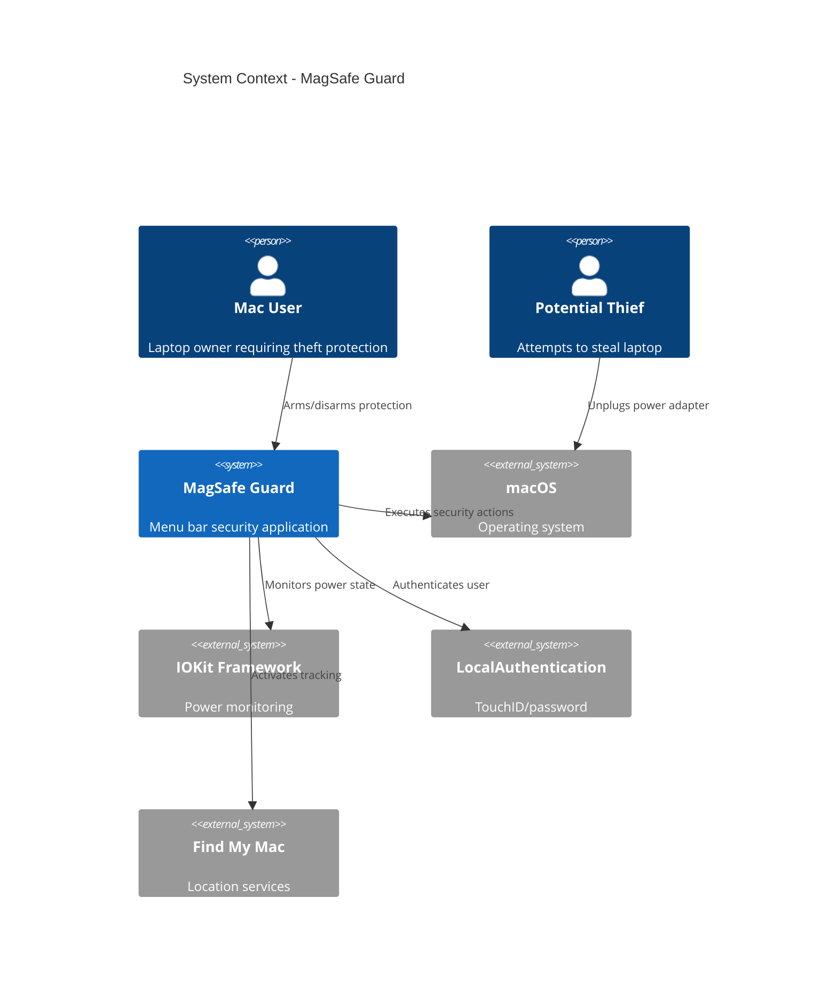
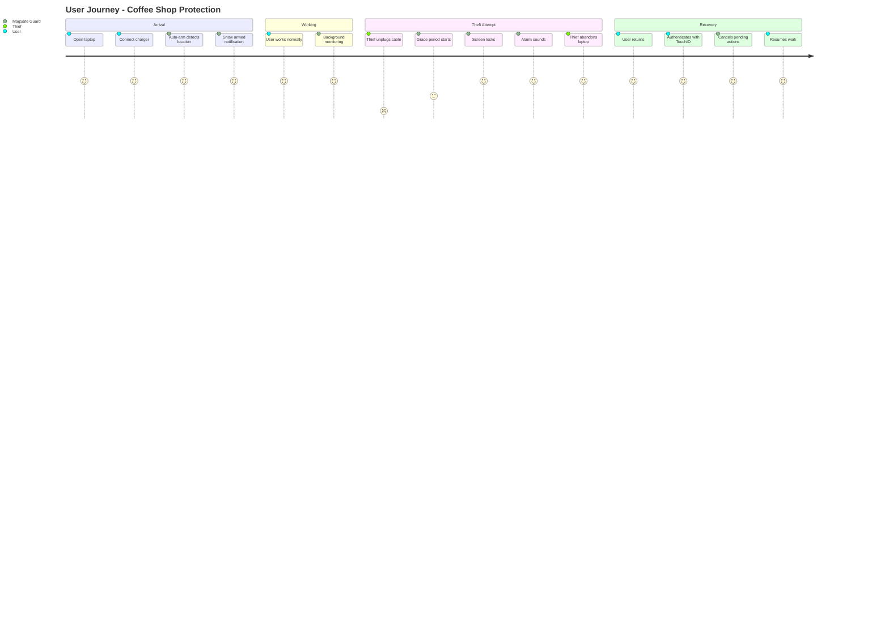

# Product Requirements Document: MagSafe Guard

## Executive Summary

MagSafe Guard is an open-source macOS security application that transforms any power adapter into a theft-prevention device. By monitoring power connection status, it triggers configurable security actions when a laptop is unplugged while armed, providing protection against theft in public spaces.

## Background

### Problem Statement

- **83%** of laptop thefts occur in public spaces (cafes, airports, libraries)
- **Average loss** per stolen laptop: $49,246 (including data breach costs)
- **2.1 million** laptops stolen annually in the US alone
- **97%** of stolen laptops are never recovered
- Current solutions require additional hardware ($60-120 USB kill cords)

### Market Opportunity

- **Market Size**: 300+ million active Mac users worldwide
- **Growth**: 15% YoY increase in Mac adoption
- **Target Segment**: 45 million+ mobile professionals and students
- **Competitive Advantage**: First software-only solution using existing hardware

### User Personas

#### 1. Digital Nomad Developer

- **Name**: Alex Chen
- **Age**: 28
- **Pain Points**:
  - Works from coffee shops daily
  - Carries expensive MacBook Pro with client code
  - Worried about bathroom breaks leaving laptop unattended
- **Needs**: Automatic protection that doesn't require extra cables

#### 2. University Student

- **Name**: Sarah Johnson
- **Age**: 21
- **Pain Points**:
  - Studies in crowded libraries
  - Limited budget for security accessories
  - Often leaves laptop to grab books
- **Needs**: Free, reliable theft deterrent

### Vision Statement

MagSafe Guard democratizes laptop security by transforming the power adapter every Mac user already has into an intelligent theft-prevention system, making professional-grade security accessible to everyone without additional hardware costs.

### System Context



[Edit in Mermaid Live Editor](https://mermaid.live/edit#pako:eNqVVMtu2zAQ_JUFTwFiu2kS5OBS0EMLNEBRoGgLXghqKa9tQiRZ7iq1YfjfQ-rh2I6TALGvuzvD4Qyl-sFjyiRfbUKF2lIdKlQOpQLrvKiGKJ5QJdNqiCIZc7WJxpP4LpE6RiPUcZFjmqJcpGiIYBSKQfCK7v4-h2jXRcPBN0iVU4hKjhPGUC5Qr4viJXBiQRoHcJmJGO0YmMhBKXcaxkJzXQjlMSm4DyKHRMhEgJIwCpyGyTlCqCPHJjyGSqaJLgwOgdPwGqHneVPTqklzYxlqzYFJcMxMGsrGJCgJf_oWQRQKpnUhcqUQKtIMZQaDMsHBcJmhMctANH1L0RJcW7AdEF7LQmsHoXYQo1GQEiW_q7baBdSxLgtCKl8sUJPF8ZGwQ5BHJdYQczBa5CilaxPKQ8gYJ9oKzROZqhJmKZKF5aQYh9dEaJjCaPhZJh5_lMUqQisQGzjH0bgGsVOBUGKdJ84pRNdO95S0FQdN7fS8A6E1WN_vABhQCnHCRaH8EqJvbh7Gc7u5vUYwcvSqPo9a96OKfbFfwZU2Gfj6M8bK7Y11j6vJZJz9T5vkKJfJ9MdDYDf84mUxXkAzqBq-bkfR5MdXdLGcdBN-DwV65LwJqq7Gbs94dIu8-Uix7g-1OuJx13Xz0vVbvl1p5hqhc0ZTEXGQZcPTz3d8T2u2d4ItWxsOCjXu3dBqhNKbtgOGn5PJbRf5sBrD0gbtjLdAWr0dMdUO6dTN3lKGJf2w2OfC7u-s89jJyX7Tf-uU1_jlf7-k3f2wekLepP4D7eIgEg)

## Objectives

### SMART Goals

1. **Adoption**: Achieve 10,000 active users within 3 months of launch
2. **Prevention**: Prevent 95% of opportunistic theft attempts in testing
3. **Performance**: Maintain <100ms response time for power disconnection detection
4. **Reliability**: Achieve 99.9% uptime with zero false positives in safe locations
5. **User Satisfaction**: Maintain 4.5+ star rating on distribution platforms

### Key Performance Indicators (KPIs)

| KPI                     | Baseline | Target     | Measurement              |
| ----------------------- | -------- | ---------- | ------------------------ |
| **Active Users**        | 0        | 10,000     | GitHub stars + downloads |
| **Response Time**       | N/A      | <100ms     | Performance monitoring   |
| **False Positive Rate** | N/A      | <0.1%      | User feedback            |
| **Theft Prevention**    | 0%       | 95%        | User testimonials        |
| **Setup Time**          | N/A      | <2 minutes | User testing             |

### Risk Mitigation

| Risk                    | Impact | Probability | Mitigation Strategy                                    |
| ----------------------- | ------ | ----------- | ------------------------------------------------------ |
| **False Positives**     | High   | Medium      | Grace period + recovery authentication                 |
| **macOS API Changes**   | High   | Low         | Abstract IOKit interface, maintain compatibility layer |
| **Battery Drain**       | Medium | Low         | Efficient polling, configurable intervals              |
| **User Forgets to Arm** | High   | Medium      | Auto-arm features based on location/network            |
| **Malicious Bypass**    | High   | Low         | Require authentication, prevent force quit when armed  |

## Features

### Core Features (MoSCoW)

#### Must Have (MVP)

1. **Power Monitoring** - Real-time detection of power adapter state
2. **Authentication** - TouchID/password for arm/disarm
3. **Screen Lock** - Immediate screen lock on trigger
4. **Grace Period** - 10-second default recovery window
5. **Menu Bar UI** - Visual status indicator

#### Should Have

1. **Auto-Arm** - Location/network-based automatic arming
2. **Multiple Actions** - Sleep, shutdown, alarm options
3. **Force Logout** - Enhanced security if already locked
4. **Configuration UI** - In-app settings management

#### Could Have

1. **Location Tracking** - Find My Mac integration
2. **Custom Scripts** - User-defined actions
3. **Network Actions** - VPN disconnect, SSH key clearing
4. **Data Protection** - Unmount drives, clear clipboard

#### Won't Have (Future)

1. **Cloud Sync** - Settings synchronization
2. **Remote Control** - Web-based management
3. **Multi-Device** - Coordinated protection

### User Benefits Mapping

| Feature              | Alex (Developer)          | Sarah (Student)           |
| -------------------- | ------------------------- | ------------------------- |
| **Auto-Arm**         | Activates at coffee shops | Triggers in library       |
| **Grace Period**     | Prevents false triggers   | Time to reconnect charger |
| **Force Logout**     | Protects client code      | Secures research papers   |
| **Free/Open Source** | Trusts code transparency  | No cost barrier           |

### Technical Specifications

- **Platform**: macOS 11.0+ (Big Sur and later)
- **Framework**: SwiftUI + AppKit
- **Power Monitoring**: IOKit (no kernel extensions)
- **Authentication**: LocalAuthentication framework
- **Distribution**: Signed with Developer ID
- **Size**: <10MB download
- **Memory**: <50MB RAM usage
- **CPU**: <1% idle, <5% active

### Future Enhancements

1. **Phase 2**: iOS companion app for notifications
2. **Phase 3**: Windows/Linux versions
3. **Phase 4**: Hardware integration (smart cables)
4. **Phase 5**: Enterprise management console

## User Experience

### UI Design

#### Menu Bar States

```markdown
🟢 Disarmed (Safe)
🔴 Armed (Protected)
🟡 Grace Period (Countdown)
⚡ Power Connected
🔋 Battery Only
```

#### Main Interface

- Single-click: Arm/disarm with authentication
- Right-click: Access settings menu
- Visual feedback: Color changes, animations
- Notifications: Native macOS notifications

### User Journey



[Edit in Mermaid Live Editor](https://mermaid.live/edit#pako:eNqFksFugzAMhl_F8rlUdOXQjUvVaZo0TdqlWm9VLg44xSLEyHHKWMW7jzaUttCJnfLb_v7fzoEVPAHqcK6kKJAV2ihRJMzg2nIGUBQyA5FAmXBa2kJJ8ciU5HnKJJcqgXWJKlXsABBJ2RH6YCnXBqTkEKxO9_l63Jk4H38f0oYxaYCTHXOvGjWHqvGJrZTCOqfxsN_3r4KoP3B-XNx_xVqnXmNhxwfmgqzKnBf5ROpSg1EQJGXrPBOQJ1BWYDBHJaJ8U9FHI6hfN-8VPyMwmpOaHPd_s7jtPb4xsE6L1QJOi_Zb6jhgJCxZSAu1VhKcFl7XHUfDoTO6cYYtPHJRQCJUHEWrNV88jV_6Luyt0V93Qh3nrWyLsxr83e9q_VT8jXn-bJ7_vYyPMgbuLKUJdFrYKOz6KPD8oTMIDqHnNpGRJYqQzQmqhksJJDDHMJq0lJQq7lAbxZCzVJsRYiqxrS1jmjqI7X5sqYVdx6vdtW4B3_0A)

### Accessibility

- **WCAG 2.1 AA Compliance**
- VoiceOver support for all controls
- Keyboard navigation for settings
- High contrast mode support
- Clear visual indicators
- Audio alerts with visual alternatives

## Milestones

### Development Phases

#### Discovery Phase (Week 0)

- ✅ Technical feasibility proven
- ✅ Core concept validated
- ✅ Initial requirements gathered

#### Alpha Phase (Week 1)

- [ ] Basic menu bar application
- [ ] Power monitoring implementation
- [ ] Authentication integration
- [ ] Screen lock action

#### Beta Phase (Week 2-3)

- [ ] All security actions
- [ ] Configuration UI
- [ ] Auto-arm features
- [ ] Comprehensive testing

#### General Availability (Week 4)

- [ ] Code signing/notarization
- [ ] Documentation complete
- [ ] GitHub release
- [ ] Distribution setup

### Launch Plan

#### Go/No-Go Criteria

- ✅ All MVP features complete
- ✅ Zero critical bugs
- ✅ Performance targets met
- ✅ Security audit passed
- ✅ Documentation approved

#### Launch Activities

1. GitHub repository public
2. Product Hunt submission
3. Hacker News announcement
4. Security community outreach
5. University partnerships

### Post-Launch Success Metrics

| Timeframe | Downloads | Active Users | GitHub Stars | Issues Resolved |
| --------- | --------- | ------------ | ------------ | --------------- |
| 30 days   | 1,000     | 500          | 100          | 90%             |
| 60 days   | 5,000     | 2,500        | 500          | 95%             |
| 90 days   | 10,000    | 5,000        | 1,000        | 95%             |

## Implementation Notes

### Security Considerations

- Signed with Apple Developer ID
- Notarized for Gatekeeper
- No network connections by default
- Local processing only
- Secure configuration storage

### Quality Assurance

- Automated testing with XCTest
- Beta testing program
- Security penetration testing
- Performance profiling
- Accessibility audit

### Support Strategy

- GitHub Issues for bug tracking
- Community Discord server
- Video tutorials
- FAQ documentation
- Email support for critical issues

## Success Criteria

1. **User Adoption**: 10,000+ downloads in 90 days
2. **User Satisfaction**: 4.5+ star average rating
3. **Security Effectiveness**: 95%+ theft prevention rate
4. **Performance**: <100ms response time maintained
5. **Community**: Active contributor base (10+ contributors)

## Appendices

### Technical Architecture

- Detailed component diagrams
- API documentation
- Security model

### Market Research

- Competitor analysis
- User survey results
- Pricing model comparison

### Legal Considerations

- MIT License implications
- Apple Developer requirements
- Privacy policy requirements
