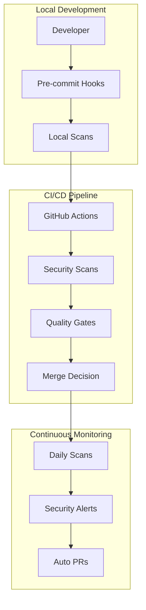

# Security-First Development: Implementing SSDLC in Open Source Projects

## A Case Study: MagSafe Guard

This document showcases how to implement a comprehensive Secure Software Development Lifecycle (SSDLC) in open source projects, using MagSafe Guard as a practical example. All tools mentioned are free for open source projects.

## Table of Contents

1. [Introduction](#introduction)
2. [The Security-First Mindset](#the-security-first-mindset)
3. [SSDLC Implementation](#ssdlc-implementation)
4. [Security Toolchain](#security-toolchain)
5. [Automation & CI/CD](#automation--cicd)
6. [Documentation & Transparency](#documentation--transparency)
7. [Community Security](#community-security)
8. [Lessons Learned](#lessons-learned)
9. [Reusable Templates](#reusable-templates)

## Introduction

MagSafe Guard is a macOS security application that demonstrates how modern open source projects can implement enterprise-grade security practices without enterprise budgets. Every tool in our security stack is free for open source projects.

### Why Security-First Matters

- **Trust**: Security applications must be trustworthy
- **Transparency**: Open source demands openness about security practices
- **Community**: Contributors need clear security guidelines
- **Compliance**: Many users require security attestations

## The Security-First Mindset

### Starting with Security

Instead of adding security later, we built it into the foundation:

1. **Threat Modeling First**: Before writing code, we identified threats
2. **Security Requirements**: Defined in `docs/SECURITY.md` from day one
3. **Secure Defaults**: Every feature defaults to the most secure option
4. **Principle of Least Privilege**: Minimal permissions requested

### Security as a Feature

We treat security as a primary feature, not an afterthought:

```yaml
# In our requirements.md
Security Requirements:
  - Authentication required for all state changes
  - No telemetry or data collection
  - Local processing only
  - Secure credential storage
```

## SSDLC Implementation

### 1. Planning Phase

**Security Activities:**

- Threat modeling using STRIDE methodology
- Security requirements documentation
- Privacy impact assessment
- Technology stack security review

**Artifacts Created:**

- `docs/SECURITY.md` - Security policy
- `docs/architecture/auth-flow-design.md` - Authentication design
- Threat model diagrams

### 2. Development Phase

**Security Practices:**

- Secure coding guidelines
- Pre-commit security hooks
- Local secret scanning
- Dependency management

**Implementation:**

```bash
# .githooks/pre-commit
#!/bin/bash
# Scan for secrets before committing
task test:security || exit 1
```

### 3. Testing Phase

**Security Testing:**

- Static Application Security Testing (SAST)
- Software Composition Analysis (SCA)
- Secret scanning
- License compliance

**Automated via CI/CD:**

```yaml
# Every commit triggers security scans
- CodeQL (SAST)
- Semgrep (SAST)
- Snyk (SCA)
- TruffleHog (Secrets)
```

### 4. Release Phase

**Security Controls:**

- Automated changelog generation
- Security advisory process
- Coordinated disclosure policy
- Signed commits and releases

### 5. Maintenance Phase

**Ongoing Security:**

- Daily dependency scans
- Security patch automation
- Incident response plan
- Regular security reviews

## Security Toolchain

### The Complete Stack (All Free for OSS)

#### Static Analysis (SAST)

##### 1. GitHub CodeQL

- **What**: Semantic code analysis
- **Languages**: 10+ including Swift
- **Integration**: Native GitHub integration
- **Features**: Custom queries, data flow analysis

##### 2. Semgrep

- **What**: Pattern-based SAST
- **Coverage**: OWASP Top 10, security anti-patterns
- **Integration**: GitHub Actions, pre-commit
- **Features**: Custom rules, auto-fix suggestions

#### Dependency Scanning (SCA)

##### Snyk

- **What**: Vulnerability scanning
- **Coverage**: Dependencies, containers, IaC
- **Integration**: PR checks, auto-fix PRs
- **Features**: License scanning, priority scoring

##### GitHub Dependabot

- **What**: Automated dependency updates
- **Coverage**: All package managers
- **Integration**: Native GitHub feature
- **Features**: Security updates prioritized

#### Secret Scanning

##### GitHub Secret Scanning

- **What**: Credential detection
- **Coverage**: 100+ secret patterns
- **Integration**: Automatic for public repos
- **Features**: Push protection, alerts

##### TruffleHog

- **What**: Git history scanner
- **Coverage**: Entire repository history
- **Integration**: CI/CD pipeline
- **Features**: Entropy analysis, regex patterns

#### Code Quality & Coverage

##### Codecov

- **What**: Test coverage tracking
- **Languages**: All major languages
- **Integration**: PR comments, badges
- **Features**: Coverage trends, diff coverage

##### SonarCloud

- **What**: Code quality + security
- **Coverage**: Bugs, vulnerabilities, code smells
- **Integration**: PR decoration
- **Features**: Quality gates, technical debt

#### Supply Chain Security

##### OSSF Scorecard

- **What**: Security best practices scoring
- **Coverage**: 18 security checks
- **Integration**: GitHub Actions
- **Features**: Automated scoring, GHAS integration
- **Configuration**: Set to report to GitHub Security tab only

##### SLSA Framework

- **What**: Supply chain integrity
- **Coverage**: Build provenance
- **Integration**: GitHub Actions
- **Features**: Signed attestations

#### Recent Security Enhancements

##### Shell Injection Prevention

- **What**: Secure GitHub Actions workflows
- **Implementation**: Environment variables for GitHub contexts
- **Coverage**: All workflow files
- **Features**: Prevents command injection attacks

##### Protocol-Based Testing

- **What**: Separation of system calls from business logic
- **Implementation**: Protocol abstractions for testability
- **Coverage**: Authentication and Security Actions
- **Features**: 100% test coverage without system side effects

### Integration Architecture



## Automation & CI/CD

### Security Workflow Design

Our main security workflow (`.github/workflows/security.yml`) runs:

1. **On Every Push**: Immediate feedback
2. **On Pull Requests**: Block insecure changes
3. **Daily Schedule**: Catch new vulnerabilities
4. **Manual Trigger**: Security audits

### Workflow Optimization

```yaml
jobs:
  # Run basic checks first (fast fail)
  basic-checks:
    runs-on: ubuntu-latest
    steps:
      - Secret detection
      - File permission checks
      - Security TODOs scan

  # Parallel advanced scans
  advanced-scans:
    needs: basic-checks
    strategy:
      matrix:
        scan: [codeql, semgrep, snyk]
```

### Security Workflow Permissions

Following the principle of least privilege:

```yaml
# Global permissions (read-only)
permissions:
  contents: read
  actions: read

# Job-specific elevated permissions
jobs:
  codeql:
    permissions:
      security-events: write  # Only for SARIF upload
```

### Pre-commit Integration

Local security checks before code reaches CI:

```yaml
# .pre-commit-config.yaml
repos:
  - repo: https://github.com/Yelp/detect-secrets
    hooks:
      - id: detect-secrets
  - repo: https://github.com/pre-commit/pre-commit-hooks
    hooks:
      - id: check-yaml
      - id: check-added-large-files
```

## Documentation & Transparency

### Security Documentation Structure

```ini
docs/
├── SECURITY.md          # Security policy & reporting
├── QA.md               # Quality dashboard with badges
├── ssdlc-case-study.md # This document
├── semgrep.md          # Tool-specific guides
├── snyk-integration.md
└── codecov-swift.md
```

### Key Documents

#### SECURITY.md

- Vulnerability reporting process
- Security contact (security@domain.com)
- Response SLAs
- Disclosure policy

#### Quality Dashboard (QA.md)

- Real-time security status
- All tool badges
- Direct links to dashboards
- Setup instructions

### Transparency Practices

- **Public Security Scans**: All results visible
- **Security Advisories**: GitHub Security Advisories
- **Commit Signing**: GPG signed commits
- **Audit Trail**: Complete history

## Community Security

### Contributor Guidelines

**Security Requirements for Contributors:**

1. Run pre-commit hooks
2. Pass all security checks
3. No hardcoded secrets
4. Follow secure coding practices

### Security Education

We provide:

- Security best practices documentation
- Tool setup guides
- Common vulnerability examples
- Fix suggestions in PR comments

### Recognition

- Security contributors acknowledged
- Security bug bounty (if applicable)
- Security champions program

## Lessons Learned

### What Worked Well

1. **Automation First**: Everything automated reduces friction
2. **Free Tools**: No budget barriers for contributors
3. **Progressive Enhancement**: Start simple, add tools gradually
4. **Documentation**: Clear guides increase adoption

### Challenges & Solutions

**Challenge**: Tool noise and false positives
**Solution**: Tuned configurations, established baselines

**Challenge**: Contributor friction
**Solution**: Optional local scans, clear fix instructions

**Challenge**: Multiple tool dashboards
**Solution**: Unified quality dashboard (QA.md)

### Best Practices Discovered

1. **Start with GitHub-native tools** (CodeQL, Dependabot)
2. **Add one tool at a time** to avoid overwhelming
3. **Document everything** with examples
4. **Make security visible** with badges
5. **Celebrate security wins** in release notes
6. **Use environment variables** for GitHub contexts in workflows
7. **Apply least privilege** to workflow permissions
8. **Separate system calls** from business logic for testing
9. **Remove unused tools** (e.g., Trivy for non-container projects)

## Reusable Templates

### For Your Open Source Project

All configurations and workflows from MagSafe Guard are reusable:

```bash
# Essential files to copy
.github/workflows/security.yml      # Security scanning
.github/workflows/test.yml          # Testing + coverage
.github/SECURITY.md                 # Security policy
.githooks/                          # Pre-commit hooks
docs/QA.md                         # Quality dashboard
```

### Quick Start Checklist

- [ ] Enable GitHub Security features
- [ ] Add SECURITY.md with contact email
- [ ] Set up basic security workflow
- [ ] Add Dependabot configuration
- [ ] Create quality dashboard
- [ ] Add security badges to README
- [ ] Configure branch protection
- [ ] Enable secret scanning
- [ ] Add pre-commit hooks
- [ ] Document security practices

### Tool Priority Matrix

| Priority | Tool            | Setup Time | Value  |
| -------- | --------------- | ---------- | ------ |
| 1        | GitHub Security | 5 min      | High   |
| 2        | Dependabot      | 5 min      | High   |
| 3        | CodeQL          | 10 min     | High   |
| 4        | Pre-commit      | 15 min     | Medium |
| 5        | Semgrep         | 20 min     | High   |
| 6        | Codecov         | 20 min     | Medium |
| 7        | Snyk            | 30 min     | High   |
| 8        | SonarCloud      | 30 min     | Medium |

## Conclusion

Implementing SSDLC in open source projects is not only possible but essential. With the right combination of free tools, automation, and documentation, any project can achieve enterprise-grade security.

### Key Takeaways

1. **Security is Free**: Every tool we use is free for open source
2. **Automation is Key**: Automate everything possible
3. **Transparency Builds Trust**: Make security visible
4. **Community Matters**: Enable contributors to be secure
5. **Start Today**: Begin with one tool and grow

### Resources

- [GitHub Security Documentation](https://docs.github.com/en/code-security)
- [OWASP DevSecOps Guideline](https://owasp.org/www-project-devsecops-guideline/)
- [This Project's Security Setup](https://github.com/lekman/magsafe-buskill)

---

_This case study is based on the MagSafe Guard project, demonstrating that security-first development is achievable for any open source project, regardless of size or budget._
